# 后端架构与流程图

**使用说明**: 在支持 Mermaid 的 Markdown 编辑器中查看（如 Typora、VS Code + Mermaid 插件、GitHub）

---

## 📊 1. 整体系统架构

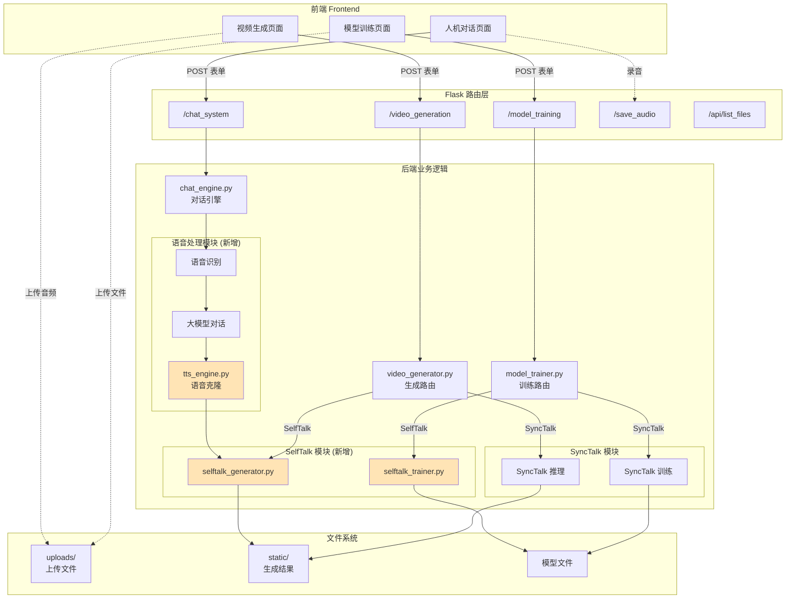

**图例**:
- 🟨 橙色模块：需要新开发的模块

---

## 🔄 2. 模型训练流程对比

### 2.1 SyncTalk 训练流程（已实现）

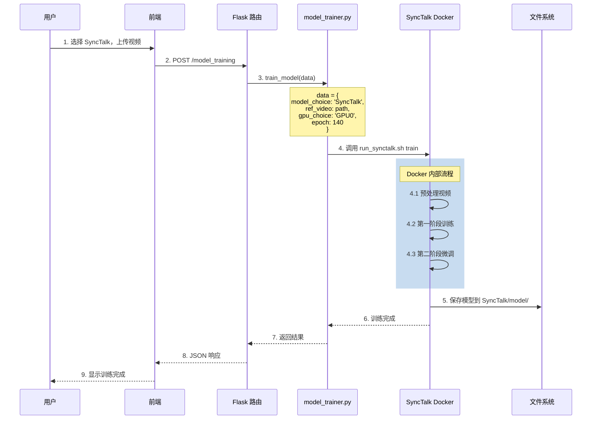

### 2.2 SelfTalk 训练流程（待实现）

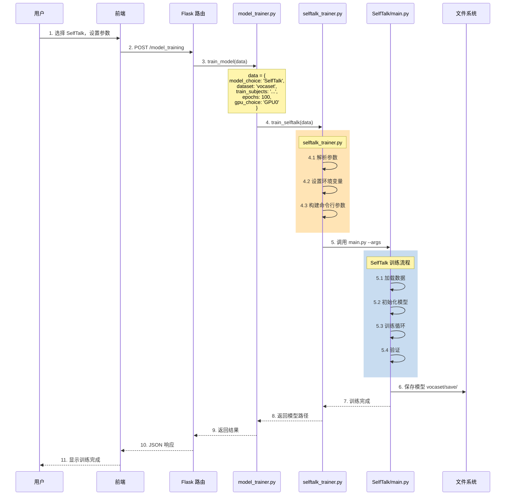

---

## 🎬 3. 视频生成流程对比

### 3.1 SyncTalk 推理流程（已实现）

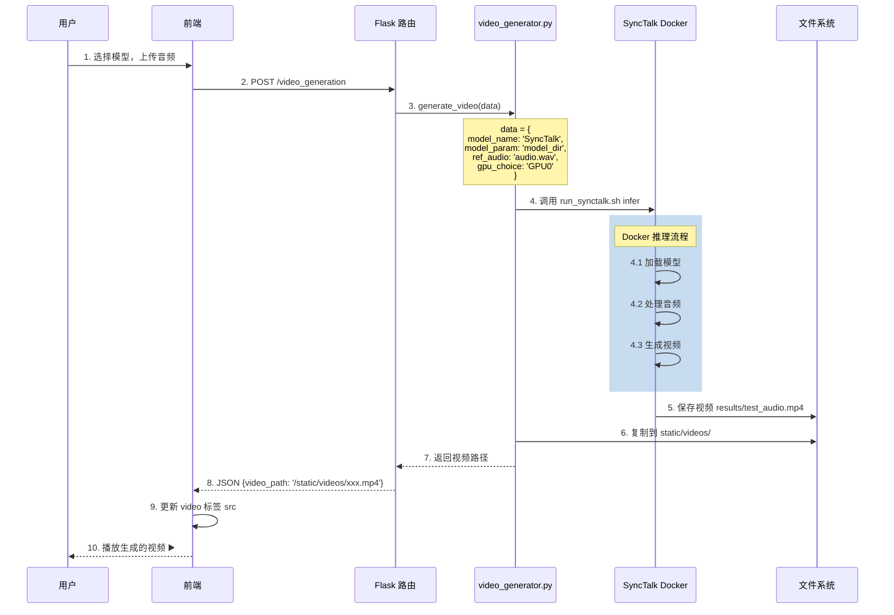

### 3.2 SelfTalk 推理流程（待实现）

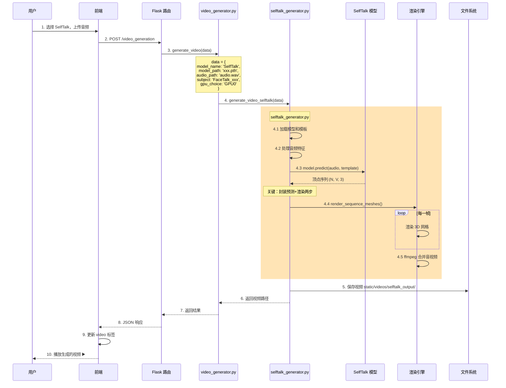

**关键点**:
- ✅ 封装预测和渲染两个步骤
- ✅ 统一接口，对外只返回视频路径
- ✅ 处理临时文件清理

---

## 🗣️ 4. 人机对话完整流程

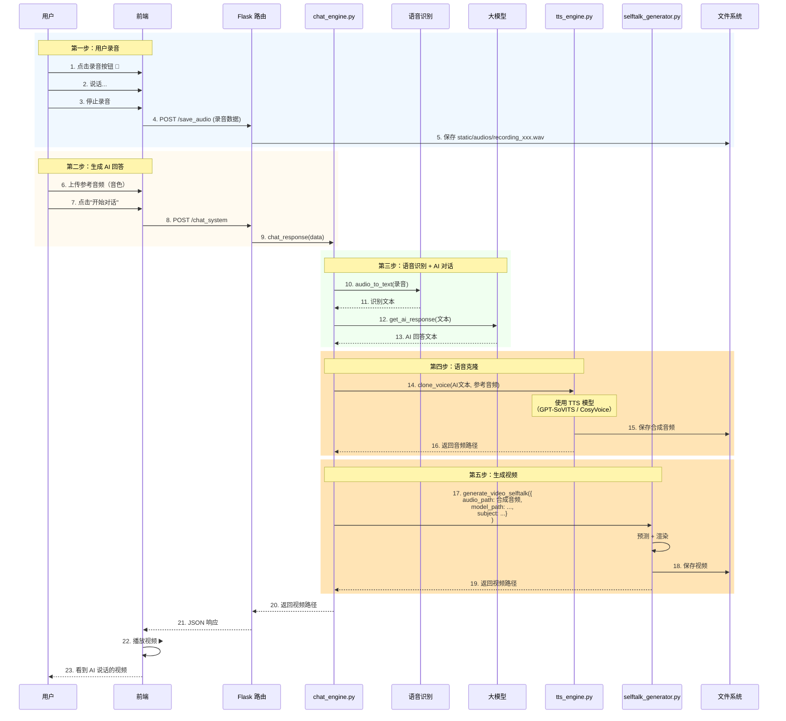

**流程总结**:
1. 🎤 用户录音提问
2. 🔊 语音识别 → 文本
3. 🤖 大模型生成回答
4. 🎵 语音克隆（TTS）→ AI 语音
5. 🎬 生成说话视频（SelfTalk）

---

## 📦 5. 数据流图

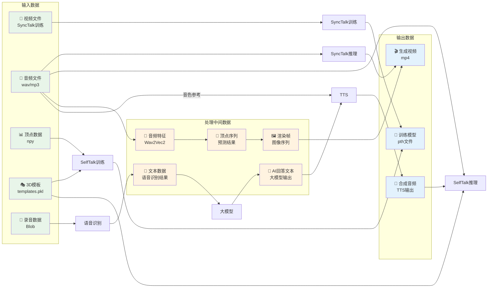

---

## 👥 6. 任务分工与依赖关系

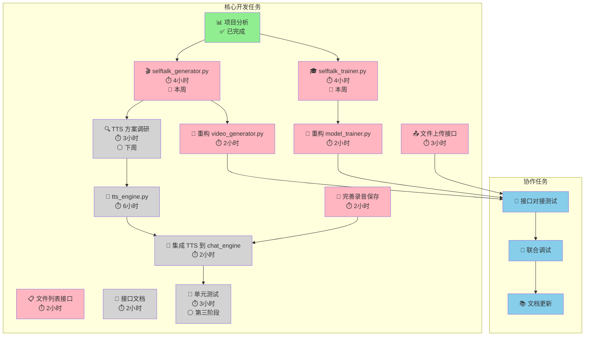

**图例**:
- 🟢 绿色：已完成
- 🔴 粉色：本周任务（P0）
- ⚪ 灰色：后续任务

---

## 🔗 7. 前后端 API 交互

### 7.1 训练接口

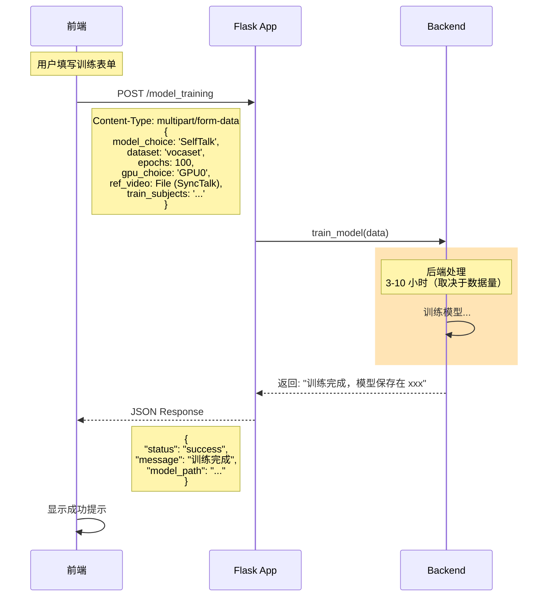

### 7.2 生成接口

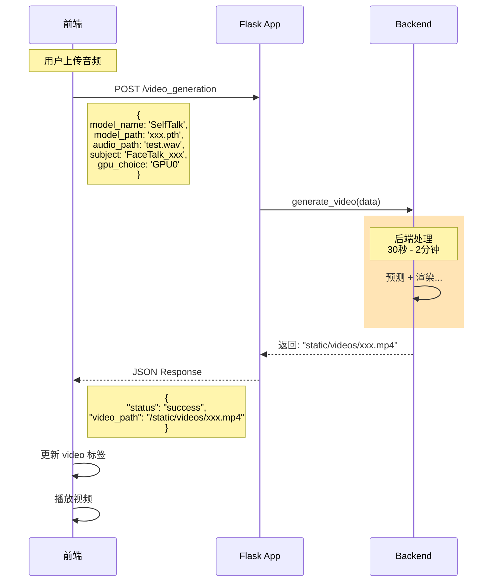

### 7.3 对话接口

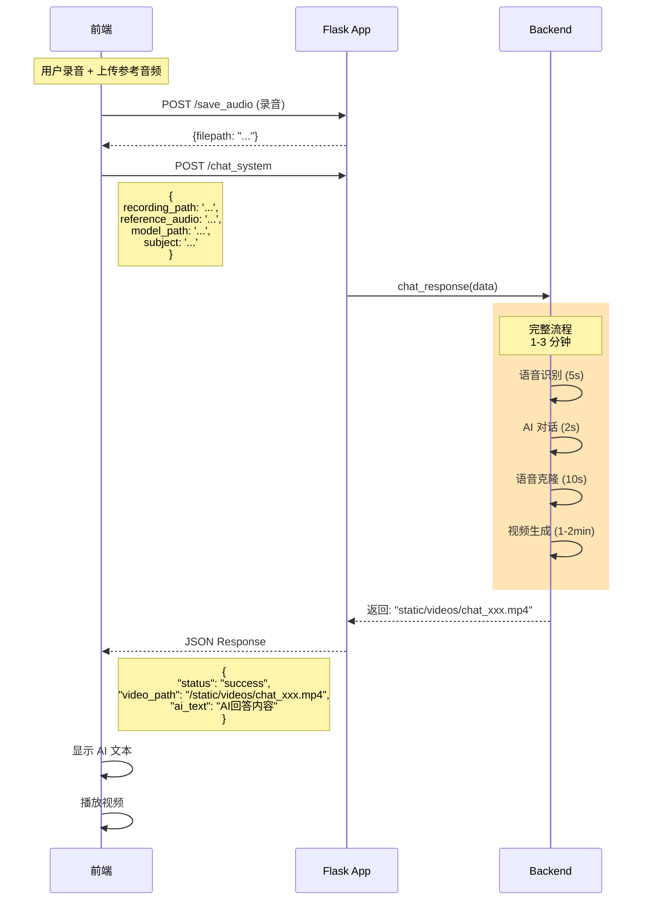

---

## 🎯 8. 本周开发重点

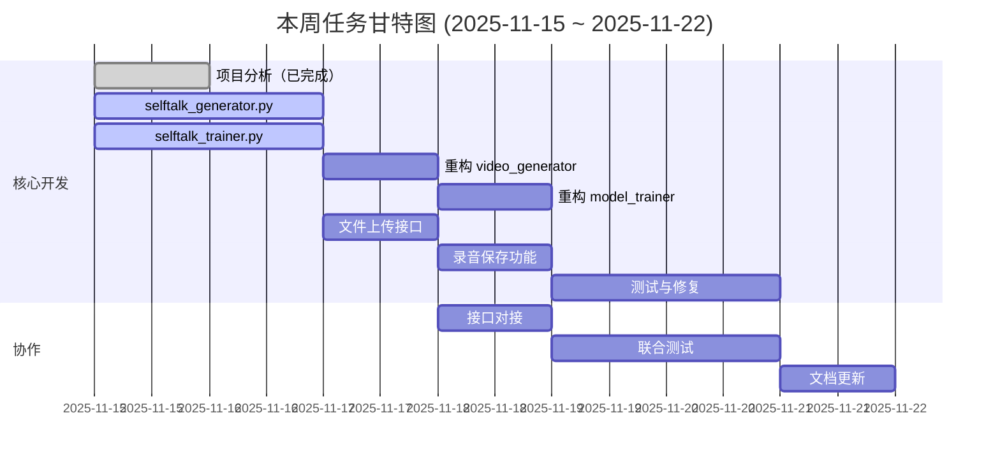

---

## 📝 快速参考

### 核心开发文件

```
backend/
├── selftalk_generator.py  ← 🎯 推理模块
├── selftalk_trainer.py    ← 🎯 训练模块
├── video_generator.py     ← 需要重构
├── model_trainer.py       ← 需要重构
└── tts_engine.py          ← 语音克隆模块
```

### 关键数据结构

```python
# 训练接口输入
train_data = {
    'model_choice': 'SelfTalk',
    'dataset': 'vocaset',
    'epochs': 100,
    'gpu_choice': 'GPU0',
    'train_subjects': 'FaceTalk_170728_03272_TA ...',
    'val_subjects': 'FaceTalk_170811_03275_TA ...',
}

# 推理接口输入
generate_data = {
    'model_name': 'SelfTalk',
    'model_path': 'SelfTalk/vocaset/save/xxx/100_model.pth',
    'audio_path': 'uploads/audios/test.wav',
    'subject': 'FaceTalk_170908_03277_TA',
    'gpu_choice': 'GPU0',
    'dataset': 'vocaset',
    'feature_dim': 512
}
```

---

**查看提示**: 
- 在 VS Code 中安装 "Markdown Preview Mermaid Support" 插件
- 或使用 Typora 编辑器
- 或推送到 GitHub 后在线查看

